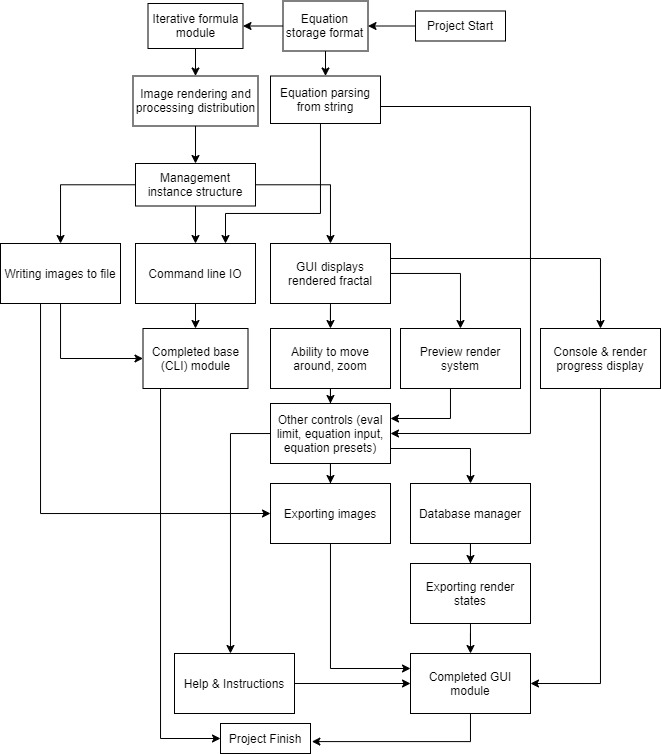

# Analysis

In my project, I intend to create a simple but well-featured graphical interface for exploring fractals, a mathematical phenomenon arising from repeated iterations of mathematical equations. The project will therefore consist of two main parts, the backend (responsible for calculating and producing the fractal itself, and usable from a terminal for more advanced users) and the frontend (responsible for displaying and allowing interaction with the user in real-time, graphical and indended to be easy to use).

## Background
### Fractals

Fractals arise from repeated iteration of a recursive mathematical equation, the most well-known being the Mandelbrot set. The equation responsible for producing it is `z = (z^2) + c`. A fractal is 'rendered' into an image by taking each pixel, calculating a position for it in the complex number space (i.e. horizontal axis becomes the real coordinate, vertical axis becomes the imaginary coordinate), and assigning that complex number to both variables `z` and `c` initially. Then, the equation is iterated repeatedly, with `c` staying constant between iterations and `z` being recalculated each time. Iteration continues until `z` tends to infinity (usually defined as having a modulus greater than 2, after which it is guaranteed to tend to infinity), or until some defined limit is reached, at which point the number of iterations completed is counted or reported. The number of iterations performed then becomes the 'value' assigned to that point in the complex number space, and be used to select a colour for a particular pixel.

Fractals are interesting primarily due to their property of self-similarity: no matter how closely you zoom in (i.e. how fine your 'pixels' are) there will always be an infinite depth of detail. The complex high-level shapes, such as the recognisable form of the Mandelbrot, are repeated (although not necessarily identically) in smaller and smaller instances. Thus, it is impossible to represent fractals using vector images, due to the fact that they have an infinite level of edge detail, and effectively an infinite circumference therefore.

Their self-similarity and detail properties has led them to be compared to (and indeed modelled against) natural shapes, such as the growth of fern leaves and coastlines (the coastline paradox is an observation that as a coastline is measured more and more precisely, its circumference seems to continue to increase, known as having a fractal dimension).

### Mathematics

Mathematics is often seen as an uninteresting topic or field, at least for anyone who doesn't already have an interest in it. It tends to be defined by equations and numeracy which many people find boring. However, fractals are an example of how mathematical ideas can apply not only to modelling nature and drawing interesting parallels with the real world, but also in producing aesthetically pleasing and beautiful images. Particularly, they can make it more engaging, especially to schoolchildren.

Thus, this project aims to, as well as providing a useful fractal visualisation tool, be a teaching aid which can give students the opportunity to experiment with fractals and learn about why they occur at the same time in an engaging fashion.

## The Problem

This brings into focus the problem which the project will address, namely the engagement of students or non-mathematical people with maths in general. Currently, tools for visualising fractals are limited, many are either demos with expensive full versions, outdated, slow, or difficult to use:
Xaos - free, interactive, but has a limited functionality and lacks ability to input custom equations
FRAX - cheap, but only runs on iOS devices and is thus limited in its processing and usability
Fractal to Desktop - Windows only
JWildfire - although very powerful, also quite complex and has a learning curve to it
Ultra Fractal - incredibly powerful and fully featured, but allows only a 30-day free trial before costing £25-80
Apophysis - limited range of fractals but lacks help/instructions

The user is likely to be one of three main categories:
* A teacher looking to engage and excite students and make maths classes more practical (particular for teaching topics such as complex numbers or iterative/numerical methods)
* A student learning maths interested in exploring mathematical phenomena or putting them to the test
* Ordinary non-mathematical people lookging to experiment in abstract design or maths

However, my primary client for the project will be a member of the mathematics department at my school. // TODO: speak with user and report!

## The Solution

Following research and a brief discussion with my user, the following requirements are apparent:
1- indicates a high-level objective
2- indicates a low-level objective

```
1-01: The program must be able to produce a rendered fractal at any resolution requested.
1-02: The program must be able to display the output to the user
1-03: The user must be able to move, navigate around, and zoom in and out of the fractal freely
1-04: The user should be able to change the equation being used
    a) The user should be able to input their own iterative equation (i.e. in place of `(z^2)+c`)
    b) The user should be able to select an equation from a list of built-in presets
1-05: The user should be able to save rendered images to a file
1-06: The user should be able to save configured states (i.e. a particular equation with a particular offset, zoom, etc) and restore them along with a pre-rendered preview image of that render state
1-07: The program should be able to generate a full screen rendered fractal in under 30 seconds
1-08: The interface must be pleasant to use and intuitive, such that a maths teacher can use it easily without confusion
1-09: The program should offer or come with instructions on how to get started and use each of its features
1-10: The user must be able to change computation and display parameters, such as the iteration limit and colour scheme
1-11: The program must be able to run on both Windows and MacOS machines
```
```
2-01: The program should present some kind of preview render which has more minimal parameters (lower resolution and iteration limit) to allow the user to navigate quickly (without having to wait for a full resolution render in between every navigation event)
2-02: The user should be able to navigate using both visual buttons and keys
2-02: The program should be runnable both as a GUI or as a CLI tool for more advanced users
2-03: The program must be able to parse mathematical expressions from a string including involving imaginary parts and evaluate them efficiently at runtime, including the following operations:
    a) brackets
    b) implicit multiplication
    c) addition
    d) subtraction
    e) multiplication
    f) division
2-04: The program must be able to utilise multithreading in order to speed up computation
2-05: The program must allow the user to numerically input offsets and zoom values
2-06: The program must be able to store and load render configuration states in a database structure when the user clicks the relevant button
    a) When storing, the program should present a dialog which autofills fields with the details of the current render state
    b) The user should be able to name their render state
    c) The user should have the opportunity for the program to save a render along with the render state
    d) The database should be stored in a system location appropriate to the platform (e.g. ~/AppData/Roaming/ProjectName on Windows)
    e) When loading, the program should present the user with a dialog which allows the user to select a saved render state to load
    f) The user should be able to search for a render state by name
    g) When loading, the program should ask the user to confirm whether they wish to discard the current rendering parameters and replace them with the loaded ones before doing so
2-07: The GUI must be able to resize and adapt its render resolution to match that of the screen for optimal user experience
2-08: The program should have an instructions area which is easy to find from the main window.
    a) The instructions should explain how to render an image
    b) The instructions should explain how to save and load render states
    c) The instructions should explain how to input custom equations, and also should describe the presets
    d) The instructions should explain the meaning of the colour scheme, zoom, offset and iteration limit parameters
    e) All of these should be explained in a way which a maths teacher or student can understand
2-09: The program should have a sensible requirement of memory to run (less than 500MiB) at any one time, which should remain consistent even if the program is open for a large period of time (dependent on the resolution being rendered at)
2-09: The program should display its rendering progress (if there is a render currently happening) and its current status, to the user
2-10: The program should lock controls such as iteration limit, offset and zoom whilst a render is occurring
```
## Project Plan



## Necessarry Libraries

The solution to the problem necessitates the use of a graphical user interface. For this, a GUI library is necessarry in order to produce a consistent experience across platforms.

A wide range of solutions are available for this. My criteria for a package were as follows:
* free to redistribute
* free to use for commercial purposes
* configurable inside another project
* compatible with the target language, in this case C++
* cross-platform
* providing features such as displaying images, buttons, text

The potential solutions which I identified included Qt, GTK+, wxWidgets, FLTK, BoostUI, and gtkmm. However, many of these did not fit my criteria fully, so I finally chose to use 'raylib', a standalone header-only graphics library which meets all the requiremeents I set out with.


The C++ standard library fortunately has a built-in complex number library. However, during my analysis phase I initially experimented with configuring and using mulitple-precision complex number libraries. The complex numbers involved in generating fractals must be very precise, so I considered using arbitrary precision arithmetic libraries such as:
* MPFR (Multiple Precision Floating-point Reliable) - provides extensible floating point data types which can be sized to any necessarry precision
* GMP (GNU Multiple Precision) - a similar library but which determines to provide better performance
* MPC (Multiple Precision Complex) - library which builds off of GMP to provide complex number arithmetic at arbitrary precision
* Boost multiple precision complex - the Boost implementation of the same functionality

However, I encountered a number of problems with all or most of these:
1. They caused a huge performance hit when benchmarked compared with the C++ standard complex number library (which is to be expected with any arbitrary precision arithmetic realistically), which would cause significant problems due to the number of calculations necessarry in this project and the intended real-time nature of it.
2. They required the target machines to have libraries installed in order to use the project and application, which also would require configuring host machines (going against the aim of the project to provide a simple, standalone, easy to install and use application)

As a result I decided to stick with the built-in complex number library, the only tradeoff being the reduced maximum precision of calculations as a result. This has the effect of effectively limiting the resolution or zoom depth possible with the application, as at a certain combination of resolution and zoom, pixels will no longer be able to be uniquely identified and their complex coordinates will be rounded to the nearest floating-point number which can be stored. In order to minimise this, in my application I will aim to use the highest precision float possible (`long double` in C++).